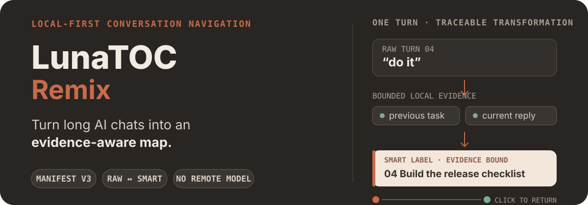

# LunaTOC Remix

<p align="center">
  
</p>

<p align="center">
  <strong>A privacy-first navigator for long AI conversations.</strong><br>
  Raw prompts when you want fidelity. Smart Labels when you need context.
</p>

<p align="center">
  <a href="#install-from-source">Install</a> ·
  <a href="#make-prompt-labels-more-useful">Smart Labels</a> ·
  <a href="#privacy-model">Privacy</a> ·
  <a href="#project-lineage-and-license">Lineage</a>
</p>

LunaTOC Remix turns the prompts in a ChatGPT conversation into a searchable,
clickable table of contents. It is designed for the moment when a useful chat
has grown into dozens or hundreds of turns and scrolling is no longer a viable
way to find the question, decision, or task you need.

> **Project status:** active development. Install from source for testing. This
> Remix does not yet have its own Chrome Web Store release.

LunaTOC Remix is an independent derivative of
[Leo7805/luna-toc](https://github.com/Leo7805/luna-toc). The repository keeps
the upstream Git history and MIT license, while new Remix development is
maintained here.

## See it in motion

<p align="center">
  
</p>

## Why this Remix exists

Raw prompts are not always good navigation labels. A turn may contain a long
brief, or it may be nothing more than “okay”, “do it”, or “the second one”. A
useful table of contents needs to remain faithful to what the user actually
asked while still making each turn easy to recognize.

The Remix is evolving LunaTOC around four principles:

- **Reliable navigation:** preserve message identity and jump to the intended
  turn, including in long and virtualized conversations.
- **Useful labels:** keep the original Prompt in Raw mode and offer conservative,
  context-aware Smart Labels when local evidence is strong enough.
- **Local-first privacy:** process conversation text in the browser without
  sending it to a model or analytics service.
- **Inspectable behavior:** keep developer diagnostics and regression fixtures
  available for debugging without exposing a technical interface to end users.

## What it can do

### Navigate conversations

- Build a prompt-level table of contents for ChatGPT conversations.
- Jump from a TOC row to the corresponding user turn.
- Expand a prompt to navigate headings inside its Assistant response.
- Follow the currently visible turn while scrolling.
- Search both the displayed label and original Prompt.
- Mark important prompts for quick visual reference.
- Resize, pin, auto-hide, and reposition the sidebar controls.

### Make prompt labels more useful

- Switch between **Raw** and **Smart** display modes.
- Complete context-dependent replies such as acknowledgements, continuations,
  and explicit choices when nearby evidence identifies one safe task.
- Compress long informative prompts with deterministic rules.
- Decide compression from normalized Prompt content, independently of sidebar width.
- Preserve critical meaning such as negation, numbers, units, versions, scope,
  and alternatives.
- Abstain and keep the original Prompt when evidence is missing, incomplete, or
  ambiguous.
- Preview the full semantic label and original Prompt on hover.

Smart Labels change presentation only. They never replace the original message,
message ID, saved Prompt, search source, or navigation target.

### Reuse prompts and personalize the sidebar

- Save prompts to **My Prompts** from the context menu.
- Import and export saved prompts as editable Markdown.
- Insert saved prompts from ChatGPT's composer with `#` or `//` autocomplete.
- Choose Luna Blue, ChatGPT Warm, Sage, Violet, or a custom color palette.
- Follow ChatGPT's light/dark theme or select a theme manually.

## Install from source

Requirements:

- Node.js and npm
- A Chromium-based browser with extension developer mode

```bash
git clone https://github.com/zhaozixuan03/luna-toc-remix.git
cd luna-toc-remix
npm install
npm run build
```

Then:

1. Open `chrome://extensions`.
2. Enable **Developer mode**.
3. Click **Load unpacked**.
4. Select this repository's generated `dist/` directory.
5. Reload the extension after every new build.

The extension currently targets ChatGPT. Other platform adapters in the source
tree are experimental scaffolding and should not be treated as supported hosts.

## Use the sidebar

1. Open a ChatGPT conversation.
2. Use **Raw** for the original Prompt text or **Smart** for locally derived
   navigation labels.
3. Click a row to return to that turn; expand it to see response headings.
4. Search to filter the table of contents.
5. Hover a shortened row to inspect the full source text.
6. Open the sidebar settings to change colors or clear the Smart Label cache.

If a newly built version appears unchanged, confirm that Chrome is loading this
repository's `dist/` directory and click **Reload** on `chrome://extensions`.

## Privacy model

LunaTOC Remix performs label generation and navigation locally in the browser.
It does not call a remote LLM, analytics service, or telemetry endpoint.

The Smart Label cache stores derived labels, compact source signatures,
decision types, message/conversation identifiers, and cache metadata in
`chrome.storage.local`. It does not persist source Prompt or Assistant response
text in that cache. The cache is bounded and can be cleared from the extension
controls.

Developer diagnostics are disabled by default, remain in tab memory, and avoid
long-term storage or upload of conversation text. Private evaluation material is
excluded from Git.

See [PRIVACY.md](PRIVACY.md) for the concise privacy statement.

## Development

```bash
npm run dev
npm test
npm run typecheck
npm run build
```

The root `manifest.json` is the source Manifest V3 definition. Production output
is generated in `dist/`; load that directory in Chrome rather than the repository
root.

Core areas:

- `src/navigation/` — prompt labels, evidence, caching, outlines, and jumping
- `src/features/sidebar/` — sidebar behavior and settings
- `src/features/conversationPrompts/` — conversation message representation
- `src/platforms/` — host-specific contracts and ChatGPT integration
- `test/` — Vitest logic and regression coverage
- `scripts/` — build, versioning, and local evaluation utilities

Architecture and durable decisions are documented in
[docs/ARCHITECTURE.md](docs/ARCHITECTURE.md) and
[docs/DECISIONS.md](docs/DECISIONS.md).

## Versioning

The npm version commands synchronize `package.json` and `manifest.json`, create
the version commit, and create a Git tag. They do not push automatically.

```bash
npm version patch
npm version minor
npm version major
```

## Contributing

Create a focused branch, add tests for changed logic, and open a pull request
against `main`. Before requesting review, run:

```bash
npm test
npm run typecheck
npm run build
```

Do not commit private conversations, local diagnostic exports, generated
`dist/`, credentials, or tokens.

## Project lineage and license

LunaTOC Remix is maintained as an independent derivative rather than a GitHub
fork. The original project remains available at
[Leo7805/luna-toc](https://github.com/Leo7805/luna-toc), and its history is
preserved in this repository. Local clones should use that repository as the
`upstream` remote and this repository as `origin`.

Released under the [MIT License](LICENSE). The inherited copyright and license
notice remain intact.
