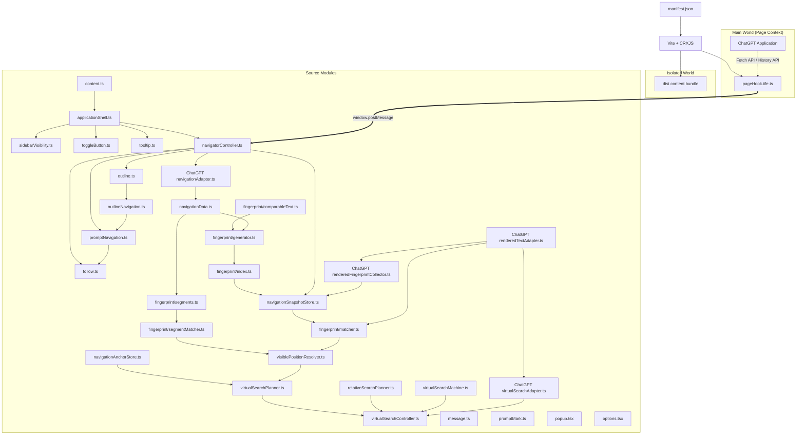

# ChatTOC Architecture

This document describes the design, context boundaries, and module coordination of the ChatTOC Chrome extension.

## Overview

ChatTOC is a Chrome Extension that inserts a table-of-contents sidebar into ChatGPT's chat interface, helping users navigate long conversations and keep track of prompts.

---

## 1. Context Boundaries & Injection Model

Because Chrome Extensions run content scripts in an **Isolated World** (preventing direct access to the page's Javascript variables and window functions), ChatTOC splits its logic into two execution worlds:



### Platform Abstraction

- Every host LunaTOC supports is described by a `Platform` record exported from [`src/platforms/platformInterface.ts`](../src/platforms/platformInterface.ts). Each record carries its own `pageHook`, `navigation`, `routing`, `contentCapture`, `diagnostics`, `config`, `messages`, `runtimeConfigKey`, and optional `theme`.
- [`getActivePlatform()`](../src/platforms/index.ts) is the only host-detection call in the codebase. It runs once at startup, walks the `PLATFORMS` registry, and returns the adapter whose `matches` accept `window.location.host`. Any module that needs platform-specific behavior calls `getActivePlatform()` and consumes `platform.*` fields rather than importing from `src/platforms/<host>/`.
- ChatGPT lives under [`src/platforms/chatgpt/`](../src/platforms/chatgpt/); it wraps the existing modules instead of rewriting them so behavior is unchanged. A [`src/platforms/copilot/`](../src/platforms/copilot/) placeholder exists where every method throws `Error('Copilot platform not yet implemented')` — see [ADR 11](DECISIONS.md#adr-11-platform-abstraction-interface).
- `APP_CONFIG` exposes a `Record<PlatformId, PlatformConfigBlock>`; `navigationAlgorithm`, `promptTopOffsetPx`, `settleAttempts`, `backfillMaxPages`, `interceptFetchNumTurns`, contract slots, and DOM selectors are all per-platform.

### Main World (`pageHook.iife.ts`)

- **Purpose**: Declared as a `MAIN` world IIFE content script and injected by Chrome at `document_start`. It resolves the active platform via `getActivePlatform()` and dispatches every hook concern through the platform adapter, intercepting the host's own native API calls and events.
- **Responsibilities**:
  1. **Fetch Hooking**: Overrides `window.fetch` to delegate request inspection and bumping to `platform.contentCapture.inspectFetchRequest` and `platform.pageHook.fetch.maybeBumpFetch`. The platform adapter decides which request shapes matter and how to read the conversation ID from the path.
  2. **History Hooking**: Overrides `history.pushState` and `history.replaceState` to notify the content script of SPA route transitions using `platform.messages.routeChanged`.
  3. **Media Query Spoofing**: Calls `platform.pageHook.installMatchMediaSpoof()` and `installMatchMediaToggleListener()` — for ChatGPT this proxies `window.matchMedia` and responsive listeners to fake a wide viewport (e.g. `1400px`), forcing the host's React app to keep its native navigation buttons mounted even when the user resizes or splits their screen. Other hosts may throw or no-op here until implemented.

### Isolated World (Content Scripts)

- **Purpose**: `src/content.ts` is declared in `manifest.json` and runs in a sandboxed context where it can access the DOM and Chrome APIs but not ChatGPT's global JavaScript scope.
- **Loading**: `src/content.ts` starts the application shell, and each module imports its explicit dependencies. Vite bundles that graph into one generated Content Script; only the entry remains in the source Manifest.
- **Source modules**:
  - [outline.ts](../src/features/navigation/outline.ts): Extracts, renders, and caches answer-heading child outlines by Prompt message ID, with stable heading descriptors for resolving rebuilt DOM.
  - [outlineNavigation.ts](../src/features/navigation/outlineNavigation.ts): Navigates from a displayed child-outline item to its current ChatGPT heading, restoring the parent prompt and re-resolving disconnected cached nodes when needed.
  - [follow.ts](../src/features/navigation/follow.ts): Provides typed chat-scroll tracking and sidebar auto-follow control through named exports.
  - [message.ts](../src/features/conversationPrompts/message.ts): Defines typed ChatGPT conversation models and normalizes user inputs, files, and images into TOC messages.
  - [promptMark.ts](../src/features/conversationPrompts/promptMark.ts): Provides typed session-scoped prompt marking and mark-button behavior through named exports.
  - [promptNavigation.ts](../src/features/navigation/promptNavigation.ts): Provides the replaceable main-prompt navigation boundary and accepts only directly resolved Prompt DOM as an independent-navigation success.
  - [navigationData.ts](../src/features/navigation/navigationData.ts): Defines platform-independent prompt/response turns for future fingerprinting and navigation algorithms.
  - [fingerprint/comparableText.ts](../src/features/navigation/fingerprint/comparableText.ts): Converts raw or rendered content into Unicode letter-and-number text shared by fingerprint generation and matching.
  - [fingerprint/generator.ts](../src/features/navigation/fingerprint/generator.ts): Generates bounded text probes and SHA-256 verification hashes from platform-independent AI responses.
  - [fingerprint/segments.ts](../src/features/navigation/fingerprint/segments.ts): Builds tab-scoped derived viewport estimates from conversation text for runtime position recognition while keeping observed DOM geometry available but inactive.
  - [fingerprint/segmentMatcher.ts](../src/features/navigation/fingerprint/segmentMatcher.ts): Verifies visible viewport text against Segment probes and hashes, preferring observed geometry and rejecting equally strong locations as ambiguous.
  - [fingerprint/index.ts](../src/features/navigation/fingerprint/index.ts): Builds one quality-tagged fingerprint record per response and merges derived/observed updates by precedence.
  - [fingerprint/matcher.ts](../src/features/navigation/fingerprint/matcher.ts): Identifies uniquely matching prompt indexes by verifying cached probes and hashes against generic rendered text blocks.
  - [visiblePositionResolver.ts](../src/features/navigation/visiblePositionResolver.ts): Resolves viewport Segment coordinates before whole-response fingerprints and platform response-ID fallback while preserving Prompt-only callers.
  - [navigationAnchorStore.ts](../src/features/navigation/navigationAnchorStore.ts): Keeps transient search observations in memory and persists only confirmed prompt scroll anchors with bounded expiry and LRU limits.
  - [virtualSearchPlanner.ts](../src/features/navigation/virtualSearchPlanner.ts): Uses observed and confirmed anchors only for the first rough position estimate.
  - [relativeSearchPlanner.ts](../src/features/navigation/relativeSearchPlanner.ts): Learns pixels per Prompt from consecutive observations, grows stalled steps, and reverses with a smaller step after crossing the target.
  - [virtualSearchMachine.ts](../src/features/navigation/virtualSearchMachine.ts): Owns the explicit initial-estimate, seek-response, and mount-prompt phases.
  - [virtualSearchController.ts](../src/features/navigation/virtualSearchController.ts): Orchestrates observation, state transitions, relative planning, scrolling, diagnostics, and bounded completion without retaining absolute search bounds.
  - [navigationSnapshotStore.ts](../src/features/navigation/navigationSnapshotStore.ts): Stores prompt lists plus revision-protected whole-response and segment fingerprint indexes by conversation for the current tab.
  - [navigationAdapter.ts](../src/platforms/chatgpt/navigationAdapter.ts): Converts ChatGPT's active conversation branch into generic navigation turns, aligns response indexes with the native TOC prompt set, and excludes tool and attachment content from AI responses.
  - [renderedTextAdapter.ts](../src/platforms/chatgpt/renderedTextAdapter.ts): Converts mounted ChatGPT Assistant Markdown into generic rendered text and exposes owned Markdown containers for observed viewport-segment measurement while excluding tools and attachments.
  - [renderedFingerprintCollector.ts](../src/platforms/chatgpt/renderedFingerprintCollector.ts): Debounces mounted Assistant DOM changes and upgrades mapped responses to observed whole-response fingerprints without running Segment geometry measurement.
  - [virtualSearchAdapter.ts](../src/platforms/chatgpt/virtualSearchAdapter.ts): Adapts ChatGPT scroll containers, viewport response text, derived Segments, mounted prompt IDs, and element geometry to generic virtual-search observations.
  - [tooltip.ts](../src/features/tooltip.ts): Provides typed preview-tooltip and button-tooltip APIs through named exports.
  - [toggleButton.ts](../src/features/toggleButton.ts): Provides the typed floating toggle-button factory and session-bound drag positioning.
  - [sidebarVisibility.ts](../src/features/sidebarVisibility.ts): Provides typed sidebar showing, auto-hiding, pinning, and inert accessibility control.
  - [externalOverlay.ts](../src/features/externalOverlay.ts): Detects open body-level fullscreen media overlays and temporarily yields all LunaTOC surfaces so host-page modal controls remain accessible.
  - [promptStore.ts](../src/features/myPrompts/promptStore.ts): Defines the saved-prompt model and provides typed persistence, caching, and change notifications.
  - [promptUsageStore.ts](../src/features/myPrompts/promptUsageStore.ts): Persists autocomplete usage counts and last-used timestamps separately from exportable prompt content.
  - [promptLibrary.ts](../src/features/myPrompts/promptLibrary.ts): Manages the saved prompt list, persistence operations, legacy confirmation dialogs, sorting, import, and export through named exports.
  - [promptEditor.ts](../src/features/myPrompts/promptEditor.ts): Bridges the legacy My Prompts API to the React create/edit dialog without coupling React components to storage.
  - [promptAutocomplete.ts](../src/features/myPrompts/promptAutocomplete.ts): Manages ChatGPT composer matching, keyboard navigation, menu positioning data, and prompt insertion through named exports.
  - [promptAutocompleteView.ts](../src/features/myPrompts/promptAutocompleteView.ts): Bridges composer autocomplete state to the React suggestion menu.
  - [myPrompts.ts](../src/features/myPrompts/myPrompts.ts): Composes the typed My Prompts modules and exports the unified `myPrompts` API consumed by the application shell.
  - [navigatorController.ts](../src/app/navigatorController.ts): Provides typed conversation data, TOC rendering, prompt navigation coordination, route resets, and active-prompt tracking.
  - [applicationShell.ts](../src/app/applicationShell.ts): Provides the typed sidebar shell, view-mode coordination, shared UI, and application initializer.
  - [content.ts](../src/content.ts): Calls the application initializer as the minimal Isolated World entry.
  - [themeSettings.ts](../src/features/theme/themeSettings.ts): Defines, persists, and migrates the follow/manual theme preference shared by the Popup and Content Script.
- [chatGptTheme.ts](../src/features/theme/chatGptTheme.ts): Detects ChatGPT's resolved root-class theme and shares the latest value with the Popup.
- [themePalettes.ts](../src/features/theme/themePalettes.ts): Defines preset palettes and applies validated Custom colors without changing resolved light/dark appearance.
- [displayModeSettings.ts](../src/navigation/displayModeSettings.ts): Persists and synchronizes the Raw/Smart TOC display preference.
- [promptLabels.ts](../src/navigation/promptLabels.ts): Separately decides contextual completion and long-label compression, then returns a structured, reason-coded result while preserving ambiguous prompts.
- [promptLabelContext.ts](../src/navigation/promptLabelContext.ts): Extracts bounded headings, ordinary task sentences, preceding user requests, questions, and option groups with message-accurate source ranges, including CRLF and multi-message tails.
- [promptLabelFocus.ts](../src/navigation/promptLabelFocus.ts): Builds a small evidence-bound task frame and rejects unsafe or unsupported candidate relations before selection.
- [promptLabelCompression.ts](../src/navigation/promptLabelCompression.ts): Produces ordered semantic, compact, and task-focused candidates while guarding numbers, units, negation targets, formats, links, code, and attachments.
- [promptLabelLayout.ts](../src/navigation/promptLabelLayout.ts): Batches actual two-line browser measurements and reselects only from semantically validated candidates when sidebar width changes.
- [promptLabelDiagnostics.ts](../src/navigation/promptLabelDiagnostics.ts): Keeps deduplicated, text-free Smart Label traces in bounded tab memory for developer-only diagnosis.
- [smartLabelStore.ts](../src/navigation/smartLabelStore.ts): Keeps derived Smart Labels stable across visits in a bounded local cache keyed by conversation/message IDs, algorithm version, and source revision signature.
- [sidebarSettings.ts](../src/features/sidebar/sidebarSettings.ts): Provides the discoverable sidebar gear panel for palette selection, Custom colors, and Smart Label cache clearing.
- [popup.tsx](../src/popup/popup.tsx): Mounts the React Popup application.
- [options.tsx](../src/options/options.tsx): Mounts the full-page React settings application.

### React UI Foundation

- React is introduced incrementally: existing DOM-driven features remain unchanged until their individual UI boundaries are migrated.
- [components/ui](../src/components/ui) contains shadcn/ui primitives; feature-specific and shared React components will live in sibling component directories.
- [reactHost.tsx](../src/reactHost/reactHost.tsx) owns the React Shadow Root, injects the compiled Tailwind stylesheet, and exposes the internal Portal container.
- [PromptEditorDialog.tsx](../src/components/my-prompts/PromptEditorDialog.tsx) renders the first migrated My Prompts interface while saving remains in the feature layer.
- [PromptAutocomplete.tsx](../src/components/my-prompts/PromptAutocomplete.tsx) renders matched prompts at viewport coordinates supplied by the composer feature and keeps a single highlight owned by the most recent pointer or keyboard interaction.
- [PopupApp.tsx](../src/components/popup/PopupApp.tsx) renders the extension Popup, including the follow-ChatGPT and manual theme controls.
- The Popup also selects the color palette, edits Custom colors, and clears persisted Smart Labels.
- [OptionsApp.tsx](../src/components/options/OptionsApp.tsx) renders the ChatGPT navigation strategy setting as immediately saved radio cards.
- Popup layout and component styling use Tailwind utilities; `popup.css` remains the Tailwind entry and retains only theme tokens and document-level base rules.
- `@/` resolves to the entire `src/` directory for browser code, React components, styles, and utilities.
- Tailwind CSS is loaded as an inline string inside the React Shadow Root, so generated global rules cannot affect ChatGPT or the legacy Content Script UI.
- shadcn theme variables are scoped to `.luna-toc-ui`, which is applied to both the React and Portal containers inside the Shadow Root.
- The React host mirrors the document's `data-theme` value onto itself so Shadow DOM components follow LunaTOC theme changes without selecting across the boundary.
- `data-palette` selects a color-token overlay independently of `data-theme`; Custom colors are validated opaque hex values applied through CSS variables.
- Smart Labels are display-only metadata. A unified resolver applies Raw/Smart mode, separate completion/compression decisions, source completion, revision-aware cache lookup, bounded local evidence, semantic guards, and reason-coded abstention. Navigation snapshots, Prompt IDs, and saved prompts continue to consume the original `NavigatorMessage`; search checks raw, semantic, and displayed labels, while hover previews retain the full semantic label and original Prompt.
- Only a candidate proven to originate from an Assistant Markdown heading may suppress that exact child-outline row. Ordinary sentence labels never remove outline content.
- Smart Label diagnostics are developer-only: the bounded trace buffer lives in memory, emits text-free console records only when `luna:debugSmartLabels` is explicitly enabled, and has no sidebar or end-user feedback surface.

### Build Outputs

- `src/config/config.ts` centralizes compile-time values intended for deliberate project tuning, including sidebar widths and a shared z-index base with semantic Sidebar, Toggle, Popover, and Modal offsets; runtime user preferences remain in their existing storage modules.
- `platforms.chatgpt.navigationAlgorithm` supplies the default `legacy-native` fallback, while `navigationSettings.ts` persists and synchronizes the user's runtime choice between native and independent navigation.
- `platforms.chatgpt.promptTopOffsetPx` keeps a small gap above prompts after independent navigation aligns them with the chat container's top edge.
- `platforms.chatgpt.settleAttempts` limits how many times independent navigation re-resolves a Prompt after ChatGPT replaces virtualized DOM.
- `navigation.search` bounds each virtual search by 32 total attempts and 4 seconds and stops response seeking earlier after 6 consecutive attempts without logical progress; unresolved positions use the same no-progress budget instead of a separate smaller limit.
- Confirmed and observed anchors participate only in the initial estimate; every later movement is relative to the current live scroll position.
- Response seeking estimates pixels per Prompt from consecutive observations, permits larger learned movements while far from the target, restores a smaller cap near the target, grows the step when the visible Prompt does not change, and halves the previous step after crossing the target.
- An unresolved observation at the top or bottom scroll boundary always moves inward before position recognition resumes, and that inward direction continues across consecutive unresolved viewports rather than returning to the stale outward direction.
- Prompt mounting is an isolated feedback scan: repeated target-response observations grow the step, crossing into the previous response reverses and halves it, and neighboring responses never return control to response seeking.
- Prompt snapshot revisions retain the previous complete Fingerprint and Segment indexes while replacements build, then swap in matching-revision results so navigation never observes an avoidable empty-index window.

### Navigation Diagnostics

Independent ChatGPT navigation supports temporary runtime diagnostics through
page `localStorage`. Enable structured, text-free jump events with:

```js
localStorage.setItem('chatTocDebugJump', '1');
location.reload();
```

Each event is written both as an expandable console object and as a
`[LunaTOC navigation JSON]` line whose complete fields survive copied or saved
console logs. `PROMPT_MOUNT_EXHAUSTED` adds text-free ChatGPT DOM evidence:
mounted and visible user-message IDs, exact target-ID candidates, matched
Assistant nodes, their inferred navigator indexes and target-text-match flags,
and their connection, visibility, and geometry state.

Per-Prompt Assistant Outline diagnostics use a separate opt-in switch and may
include extracted heading text:

```js
localStorage.setItem('chatTocDebugOutline', '1');
location.reload();
```

Remove `chatTocDebugOutline` and reload to stop Outline logging.

Override selected test parameters without rebuilding:

```js
localStorage.setItem(
  'chatTocNavigationTestConfig',
  JSON.stringify({
    settleWaitMs: 300,
    settleAttempts: 5,
    maxSearchAttempts: 12,
    maxUnproductiveSearchAttempts: 6,
    maxSearchDurationMs: 3000,
    useConfirmedAnchors: false,
    useObservedAnchors: true,
  })
);
location.reload();
```

Remove both keys and reload to restore project defaults. Diagnostics include
IDs, indexes, anchor sources, plans, and geometry, but never Prompt or response
text.
- Pure logic tests live under `test/`, run with Vitest in a Node environment, and use the same `@/` source alias as browser code.
- DOM-dependent platform adapter tests opt into jsdom per test file; other tests remain in the default Node environment.
- `manifest.json` is the source Manifest and authoritative extension version.
- `vite.config.ts` uses Vite and CRXJS to discover extension entries and cleans source extensions from generated entry names after CRXJS finishes writing the build.
- `dist/manifest.json` is generated for Chrome and rewrites source entry paths to built assets.
- `dist/` is generated and ignored by Git; run `npm run build` before loading or packaging the extension.
- All executable files under `src/` are TypeScript; Chrome runs only the JavaScript generated in `dist/`.
- `src/content.ts` starts both the legacy application shell and the isolated React host; the Tailwind entry is imported only by the React host using Vite's `?inline` query.
- `scripts/version.ts` is executed through `tsx`, while `tsconfig.node.json` strictly checks Node-side tooling separately from browser code.

---

## 2. Communication Protocol

Data flows from the page's Hook script to the content script using window messages. Channel names are platform-namespaced — every adapter exposes its own set through `Platform.messages`, so two adapters can never collide. ChatGPT currently publishes:

- `CHATGPT_CONVERSATION_DATA`: Sends the full JSON conversation tree on page load or full conversation update.
- `CHATGPT_NEW_USER_MESSAGE`: Streams newly submitted user prompts in real-time.
- `CHATGPT_ROUTE_CHANGED`: Dispatched instantly when a routing URL transition takes place.
- `CHATGPT_NAVIGATOR_SET_WIDTH_SPOOF`: Sent from the content script to toggle media query spoofing on/off when the sidebar visibility state toggles.
- `LUNA_CHATGPT_CONFIG_UPDATE`: Sent from the content script to publish effective contract values back to the page-hook so detection can compare observed requests against the developer's active expectations.
- `LUNA_CONTRACT_MISMATCH`: Sent from the page-hook to the content script when an observed contract slot no longer matches the expected value.

Adding a new platform means publishing a parallel `COPILOT_*` (or `CLAUDE_*`, etc.) set through its own `messages` record.
